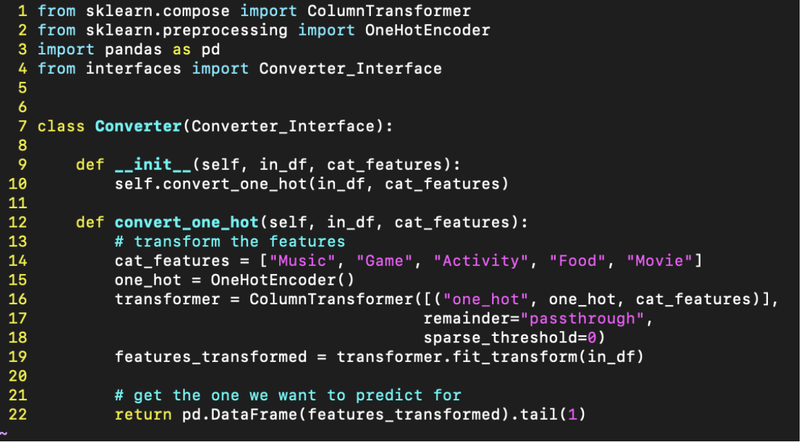

1) Description
 > Gif Machine is an online application that will give users a personal meme viewing experience that is tailored to them. The value of the application is giving users that personal aspect along with providing convenience. With GifMachine, people can log into their accounts. Each account will have their preference in gifs, along with their email address and password. Accounts will store preferences based on a series of questions, each one having multiple choices. The user can reset their preferences by simply answering the questions again. The gifs will appear sequentially, almost like TikTok shows videos. Instead, we will pull gifs from other sources that store gifs, such as Giphy. This means that gifs will instead be stored with a source URL and users can click on that to access the original gif.

2) Architecture
 > Our architecture is designed the way it is so that we can use the Node.js server. We see the server as the central point in our system, and so everything has to be able to interact correctly with the server. So, the predictions made by our ML model are implemented in a python script so that the server can run the script when it needs to so that it can easily make a prediction and save it to a .json file to be used by the server. The Giphy API is implemented at this high a level to make it easier to access from the Node.js server. Finally both the script and the server have access to the database so that both can save predictions and access previously made predictions.
 > 

3) Class diagram
> 

4) Sequence diagram
> .png)
5) Design Patterns

6) Design Principles
> Our design observes SOLID principles by making a new class for each action, an then pulling all of these classes together using the composition design pattern to treat this group of objects as one object. Each object has an interface stating which methods should be implemented. 

> S (Single Responsibility): This image shows how the single responsibility principle is observed, as this Converter class only has to worry about converting categorical features.
>  

> O (Open Close):  These images show how the open close principle is observed. The KMean_Prediction class extends the Prediction class, but does not require any changes to the Prediction class to be used.
> 
> 

> L (Liskov Subsitiution): Again, the classes above show how Liskov Substitution is observed. The KMean_Prediction class contains a regular Prediction class within it, so it is able to be used as a Prediction class without any problems.

> I (Interface Segregation): Here, you can see a file listing all of our interfaces for the prediction making code. We had to implement this in a sort of strange fashion, as Python does not offer native support for interfaces, so there is a lot of extra syntactic sugar that went into making this work.\
> 

> D (Dependency Inversion): As shown above in the O principle, because we are using composition along with regular inheritance, we are making it easy to add anything that any developer needs to make a subclass, such as a KMeans_Prediction, work, and the superclasses will not be affected by the changes to the subclass.

