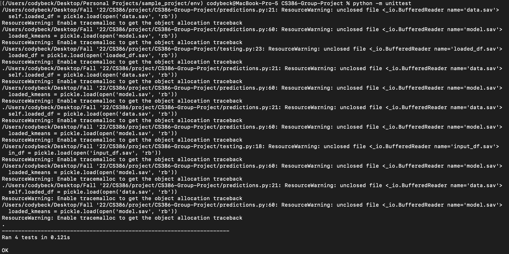

# 1. Introduction

# 2. Implemented requirements
> Requirement: As a college student, I want to be able to view gifs personalized to my humor so that I have a more entertaining gif viewing experience. <br>
  Issue: https://github.com/BaileyMcCauslin/CS386-Group-Project/issues/11 <br>
  Pull request: https://github.com/BaileyMcCauslin/CS386-Group-Project/pull/22 <br>
  Implemented by: Cody Beck <br>
  Approved by: Bailey McCaulsin <br>
  
> Requirement: The college student will be able to complete a survey to find their gif preferences. <br>
  Issue: https://github.com/BaileyMcCauslin/CS386-Group-Project/issues/23 <br>
  Pull Request: https://github.com/BaileyMcCauslin/CS386-Group-Project/pull/25<br>
  Implemented by: Bailey McCauslin <br>
  Approved by: Andrew Usvat<br>
  
> 


# 3. Tests
You should implement automated tests that aim to verify the correct behavior of your code. Provide the following information:
Test framework you used to develop your tests (e.g., JUnit, unittest, pytest, etc.):

The framework we used to develop our tests for the ML prediction program was unittest.

Link to your GitHub folder where your automated unit tests are located: [GitHub](https://github.com/BaileyMcCauslin/CS386-Group-Project/tree/testing)

An example of a test case. Include in your answer a GitHub link to the class being tested and to the test.
An example of a test case is: 
```
def test_transform(self):
    self.assertEqual('no', p.transform_with_map([0]))
 ```

[Class](https://github.com/BaileyMcCauslin/CS386-Group-Project/blob/testing/predictions.py)
<br>
[Test](https://github.com/BaileyMcCauslin/CS386-Group-Project/blob/testing/testing.py)

A print screen showing the result of the execution of the automated tests. 


# 4. Adopted technologies
> React JS - We are using React as our web framework because it allows for dynamic components, state handling, and easy styling. It’s extremely easy to load in GIF’s dynamically and route to different pages.  

> Firebase/Firestore - Since we need to store little amounts of data, we chose to use firebase and firestore because of its easy user authentication and store small data in collections in firestore. Firebase is extremely easy to use with very little set up time without being overkill for our project. 

> Pandas - We are using Pandas dataframes to provide the inputs into the machine learning algorithm, as scikit-learn expects input in the form of a dataframe. We also used Pandas because Pandas dataframes are very easy to work with, as Pandas allows dataframes to be easily saved to and from .csv files.

> Scikit-learn - We chose scikit-learn over PyTorch and TensorFlow for its simplicity. Scikit-learn is really easy to use for simple machine learning problems. Seeing as we have are using a clustering model, which is super simple, it made more sense to just chose the simplest ML library. With scikit-learn, we are using the KMeans algorithm, as KMeans is a pretty simple and well used clustering algorithm. 

> Pickle - We used pickle to save the trained ML model. Using pickle you can save entire objects and open them in different .py files. This made our code lightweight as we did not have to retrain the algorithm every time we use. 

# 5. Learning/training

# 6. Deployment

# 7. Licensing
We chose the MIT License. We chose this license for this permissibility. We liked that it allowed for many different uses, as we are all supporters of open source software. We also chose it because it provides no guarantees or warranties, and as this is student code, we do not want anyone to assume it to be perfect.

# 8. Readme File
https://github.com/BaileyMcCauslin/CS386-Group-Project/blob/main/README.md

# 9. Look & feel

The approach to the design is quite simple. We wanted to apply a simple theme that sort of appeals to people who are joke enthusiasts and is similar to other joke sites but is unique at the same time. We used a unique color background theme and a set color scheme for all the text and implemented some cool front end design elements.


# 10. Lessons learned
We learned that we should make more time to deploy the application because it took longer than expected to accomplish deployment. We also learned the lesson of communicating on what dependencies we are going to use, we ran into a bunch of dependency discrepancies that could've been avoided if we just communicated. We also need to clean up our version control a little bit, it got messy at times. We also want to make sure everyone is in the loop about the technologies each of us specialize in so if we need to fix something and someone is not available, someone else will know how to work with that technology.

# 11. Demo
