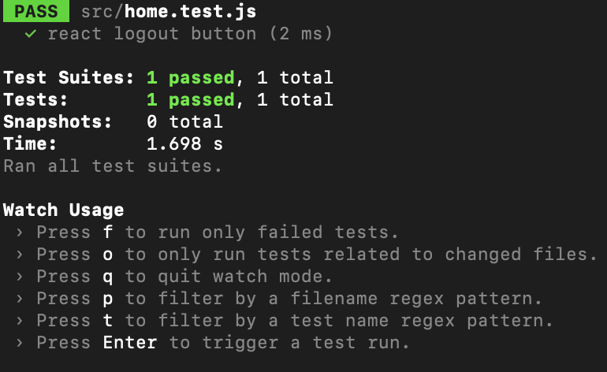

# D.6 Implementation 2

## Introduction
> Gif Machine is an online application that will give users a personal meme viewing experience that is tailored to them. The value of the application is giving users that personal aspect along with providing convenience. With GifMachine, people can log into their accounts. Each account will have their preference in gifs, along with their email address and password. Accounts will store preferences based on a series of questions, each one having multiple choices. The user can reset their preferences by simply answering the questions again. The gifs will appear sequentially, almost like TikTok shows videos. Instead, we will pull gifs from other sources that store gifs, such as Giphy. This means that gifs will instead be stored with a source URL and users can click on that to access the original gif.

## Implemented requirements
> Requirement: As a user, I want to be able to logout of my account for security reasons.  
  Issue  Link: https://github.com/BaileyMcCauslin/CS386-Group-Project/issues/29  
  Pull Request: https://github.com/BaileyMcCauslin/CS386-Group-Project/pull/30  
  Implemented by: Bailey McCauslin  
  Approved By: Nick Henderson  
  

> Requirement: As a college student, I want to be able to view gifs personalized to my humor so that I have a more entertaining gif viewing experience.  
  Issue: https://github.com/BaileyMcCauslin/CS386-Group-Project/issues/11  
  Pull request: https://github.com/BaileyMcCauslin/CS386-Group-Project/pull/22  
  Implemented by: Cody Beck  
  Approved by: Bailey McCaulsin  
  
  
> Requirement: The college student will be able to complete a survey to find their gif preferences.  
  Issue: https://github.com/BaileyMcCauslin/CS386-Group-Project/issues/23  
  Pull Request: https://github.com/BaileyMcCauslin/CS386-Group-Project/pull/25 
  Implemented by: Bailey McCauslin  
  Approved by: Andrew Usvat 
    
  
> Requirement: As a college student, I want to be able to have my own account so I dont have to answer the survey everytime.  
  Issue:  https://github.com/BaileyMcCauslin/CS386-Group-Project/issues/11  
  Pull request: https://github.com/BaileyMcCauslin/CS386-Group-Project/pull/22  
  Implemented by: Bailey McCauslin and Andrew Usvat  
  Approved by: Bailey McCauslin  
  

## Tests
> Test framework you used to develop your tests (e.g., JUnit, unittest, pytest, etc.): 
> - We developed these tests using the jest framework for JavaScript and unittest module for Python.

> Link to your GitHub folder where your automated unit tests are located:
> - [Link](https://github.com/BaileyMcCauslin/CS386-Group-Project/tree/testing)

> An example of a test case. Include in your answer a GitHub link to the class being tested and to the test.
> - One example of a test case was our home.js module, where new functionality was added to support the log-out button.

> A print screen showing the result of the automated tests execution. 
> 

## Demo

## Code quality
> To manage code quality, we adopted a set of best practices for our team. We all prefer to use different editors, which made setting these standards important as we wanted everyone’s code to be formatted correctly. We decided that the use of tabs was allowed, as long as they were soft tabs, and this worked very well for everyone. Then we decided on standards for each language we were using. For Python, we decided to stick to the PEP 8 convention, and for JavaScript, we decided to us Google’s style guide. From there, we made sure that everyone used appropriate whitespace to separate logical units in their code. Finally, we settled on the decision that self-documenting code was preferable to the use of comments, but comments should be used when necessary to explain trickier parts of code, or things that aren’t self-evident to someone without experience in a specific area (i.e. commenting ML code). We found that pretty much everyone abided to these practices already, and as not a single group member had to make a big adjustment to the way they coded, sticking to these best practices did not slow down productivity.

## Lessons learned
> We realized several of our issues from the first implementation and learned how much of a difference testing makes in a system in finding and fixing bug issues. That being said, we did a lot of testing in this implementation so while implementing new features and things that should be added, we assured that their would be no problems with it. Another thing that we took away is the quality of code and how it is important, as many of us were adding updates we found that using each others code can be difficult if written improperly or without a standard. Because we were able to create a standard and assure good code quality, we were able to proficiently complete the implementation.

