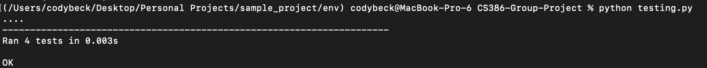

# D.7 V&V

## Description
> * Gif Machine is an online application that will give users a personal meme viewing experience that is tailored to them. 
The value of the application is giving users that personal aspect along with providing convenience. 
With GifMachine, people can log into their accounts. Each account will have their preference in gifs, along with their email address and password. 
Accounts will store preferences based on a series of questions, each one having multiple choices. The user can reset their preferences by simply 
answering the questions again. The gifs will appear sequentially, almost like TikTok shows videos. Instead, we will pull gifs from other sources 
that store gifs, such as Giphy. This means that gifs will instead be stored with a source URL and users can click on that to access the original gif.

## Verification (tests)

### Unit test
> Test framework you used to develop your tests (e.g., JUnit, unittest, pytest, etc.): We used unittest for our automated unit testing.
> * Link to your GitHub folder where your automated unit tests are located: [Link](https://github.com/BaileyMcCauslin/CS386-Group-Project/tree/testing)

> An example of a test case that makes use of mock objects. Include in your answer a GitHub link to the class being tested and to the test.
> * One test case that uses mock objects is testing if our ML model actually does categorical conversions using one hot encoding and returns the results as a pandas DataFrame.
> * Class: [Link](https://github.com/BaileyMcCauslin/CS386-Group-Project/blob/testing/predictions.py)
> * Test: [Link](https://github.com/BaileyMcCauslin/CS386-Group-Project/blob/testing/testing.py)

> A print screen showing the result of the unit tests execution. 
> * 

### Acceptance Test

> Test framework you used to develop your tests (e.g., Selenium, Katalon Studio, Espresso2, Cucumber, etc.):

> Link to your GitHub folder where your automated acceptance tests are located.

> An example of an acceptance test. Include in your answer a GitHub link to the test and an explanation about the tested feature.

> A print screen/video showing the acceptance test execution.

## Validation

> User 1:
> * Time to complete the task: 2 minutes
> * Satisfaction with a resulting gif: 8
> * Overall impression of the website: 7
> * Comparison to other gif-generating websites: "I like the options for customizing the gif on your website more than on other websites I've used."
> * Likelihood of using the website again: 8

> User 2:
> * Time to complete the task: 1 minute
> * Satisfaction with a resulting gif: 6
> * Overall impression of the website: 5
> * Comparison to other gif-generating websites: "It's similar to other websites I've used, but it was a bit slow to load for me."
> * Likelihood of using the website again: 6

> User 3:
> * Time to complete the task: 3 minutes
> * Satisfaction with a resulting gif: 9
> * Overall impression of the website: 8
> * Comparison to other gif-generating websites: "It has less variety of options but it was easy to use in comparison."
> * Likelihood of using the website again: 9

> Reflections:
> * Overall, the users were able to complete the task of viewing and generating personalized gifs within a reasonable amount of time and were generally satisfied with the results. The website received mostly positive feedback for its layout and design, as well as the options for customizing the gif. One user mentioned that the website was a bit slow to load, which could be an area to improve. Overall, it seems that the initial goals of the website are being achieved and the features are implemented in a satisfactory way. The value proposition of providing a user-friendly and the customizable gif-generating platform is being accomplished.

